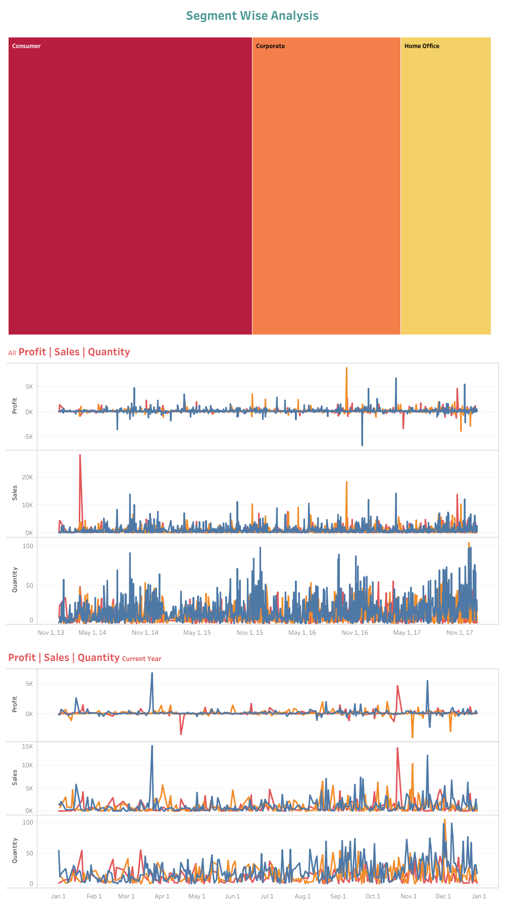
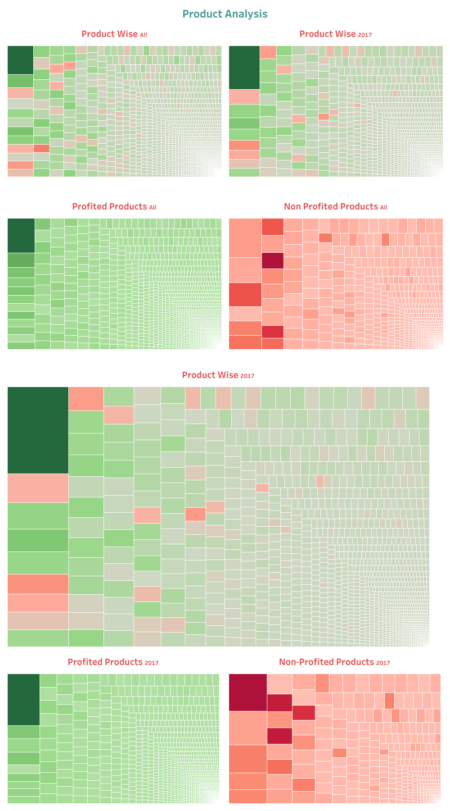
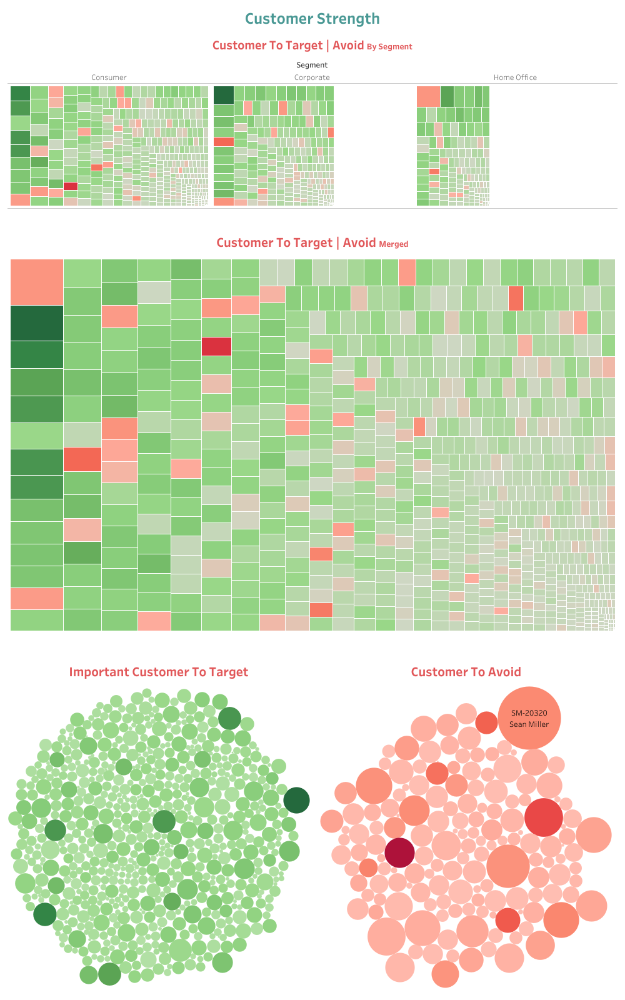
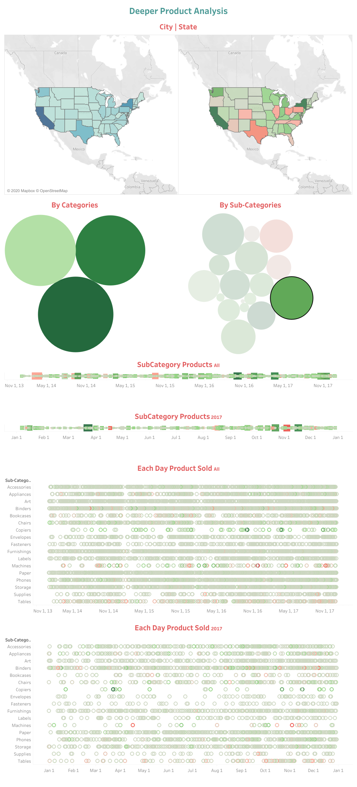
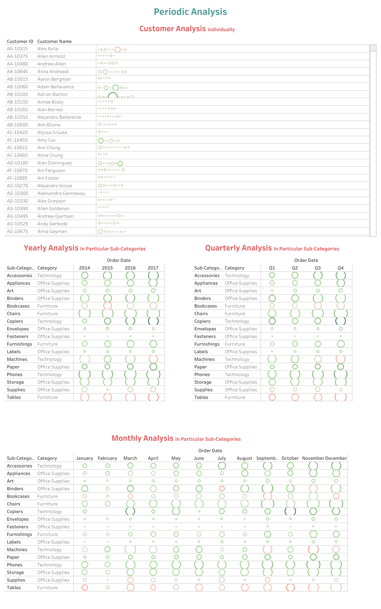

# *E-Commerce Business Analysis- Data Science Project*
### Questions:
- [x] Which Segment is making most of our Profit/ Sales/  Quantity{Q} sold?
- [x] If any specific regular customer we have, what are their number of count, what are they buying most, which categories, sub-categories and product they are contributing positively in our Sales / Profit / Quantity{Q} ?
- [x] What is the condition of State / City in condition of Sales / Profit / Quantity{Q} ?
- [x] Which Categories we should focus on more next?
- [x] Which product that we should more focused next?
- [x] How the Time Series on Profit / Sales / Quantity{Q} ?
- [x] Deeper Product analysis in weekly, monthly, quarterly and yearly, what is their(Products) behaviour?
- [x] Customer / Consumer behaviour on every particular product, what is their relationship between products and profit / Sales? 

>Tableau Dashboards:
#### *Segment Wise Analysis*

#### *Product Wise Analysis*

#### *Customer Strength*

#### *Deeper Product Analysis*

#### *Individual Product Analysis on Time*

  

## *Get Touch With Me:*
[RakibHHridoy](https://rakibhhridoy.github.io) 
[Linkedin](https://linkedin.com/in/rakibhhridoy)
